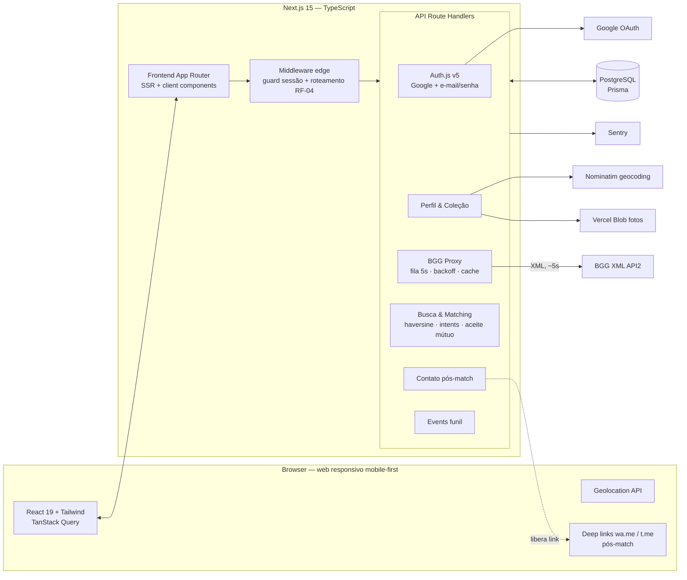

# JogaJunto MVP — Documentação Técnica e Plano de Tarefas

**Base:** PRD v2 "Pareador de Jogos de Tabuleiro" + Figma "MVP - JogaJunto" (telas v2-01 a v2-09)
**Autor:** Engenharia (arquitetura)
**Alvo da v1:** Web app responsivo, mobile-first (RNF-01), desktop suportado
**Stack decidida:** Next.js 15 full-stack em TypeScript + PostgreSQL

---

## 1. Decisões de arquitetura

| Decisão        | Escolha                                                                                        | Justificativa                                                                                                                                                       |
| -------------- | ---------------------------------------------------------------------------------------------- | ------------------------------------------------------------------------------------------------------------------------------------------------------------------- |
| Topologia      | **Monólito modular** (Next.js App Router: frontend + API no mesmo deploy)                      | MVP com 1 time pequeno; elimina orquestração de 2 deploys, CORS e contratos duplicados. Módulos de domínio isolados permitem extração futura.                       |
| Linguagem      | **TypeScript ponta a ponta**                                                                   | Tipos compartilhados (Zod) entre UI e API; um só toolchain.                                                                                                         |
| Frontend       | React 19 + App Router (RSC), Tailwind CSS, TanStack Query                                      | Mobile-first com SSR (primeiro paint rápido em 4G); tokens extraídos do Figma.                                                                                      |
| Backend        | Route Handlers (`/app/api/*`) + middleware edge                                                | Suficiente para CRUD + proxy BGG + matching. Sem necessidade de serviço separado.                                                                                   |
| Banco          | **PostgreSQL gerenciado** (Neon/Supabase/Railway) + Prisma                                     | Relacional casa com o domínio (usuário↔jogos↔pedidos↔matches). Distância via haversine em SQL — PRD dispensa indexação espacial no MVP; PostGIS fica como evolução. |
| Auth           | Auth.js v5 (Google OAuth + Credentials/argon2id), sessão JWT                                   | Cobre RF-01/02/03/05 com pouco código; claim `profileComplete` no token resolve o roteamento do fluxograma (RF-04).                                                 |
| Integração BGG | **Proxy server-side obrigatório** com fila rate-limit (~5s), retry/backoff e cache em Postgres | Exigência do RNF-05 (rate limit, CORS, resiliência). Cliente nunca fala com a BGG.                                                                                  |
| Contato        | Deep links `wa.me` / `t.me`, liberados por endpoint que valida o match                         | Garante RNF-09 no servidor, não na UI.                                                                                                                              |
| Analytics      | Tabela `events` própria + SDK leve no cliente (PostHog opcional)                               | Instrumentação é pré-requisito de lançamento (PRD §10). Dados ficam no nosso banco.                                                                                 |
| Deploy         | Vercel (preview por PR + prod) + GitHub Actions                                                | Zero-ops, cron nativo para expiração de intents.                                                                                                                    |

**Princípios inegociáveis (derivados do PRD):**

1. Coordenadas exatas **nunca** saem do backend — API só retorna distância aproximada já formatada (RNF-07).
2. Contato (WhatsApp/Telegram) **só** é retornado por endpoint que valida match do solicitante (RF-24/25, RNF-09).
3. Toda chamada BGG passa pelo proxy com rate limit global (RNF-05).
4. Eventos de funil emitidos desde o primeiro deploy (RNF-10).

---

## 2. Arquitetura macro

Desenho completo: `arquitetura-macro-jogajunto-mvp.svg` (anexo).



### Fluxo crítico mapeado às telas do Figma

| Etapa                | Tela Figma                              | Rota                      | Módulos                      |
| -------------------- | --------------------------------------- | ------------------------- | ---------------------------- |
| Login                | v2-01-login                             | `/login`                  | Auth                         |
| Cadastro             | v2-02-cadastro                          | `/cadastro`               | Auth                         |
| Configurar perfil    | v2-03-perfil                            | `/perfil/configurar`      | Perfil, BGG Proxy, Geocoding |
| Confirmação jogo BGG | v2-04-perfil-bgg-confirm (bottom sheet) | — (componente)            | BGG Proxy                    |
| Home (2 modos)       | v2-05-home                              | `/home`                   | Busca, Coleção               |
| Resultados           | v2-06-resultados                        | `/busca/[bggId]`          | Busca & Matching             |
| Sem resultados       | v2-09-sem-resultados                    | `/busca/[bggId]` (estado) | Busca                        |
| Convites & Matches   | v2-07-convites-matches                  | `/convites`               | Matching                     |
| Match + contato      | v2-08-match-contato                     | `/match/[id]`             | Contato pós-match            |

---

## 3. Modelo de dados (Prisma/PostgreSQL)

```prisma
model User {
  id            String   @id @default(cuid())
  email         String   @unique
  passwordHash  String?              // null se só Google (RF-01/02)
  emailVerified DateTime?
  createdAt     DateTime @default(now())
  profile       Profile?
  accounts      Account[]            // OAuth (padrão Auth.js)
  games         UserGame[]
  intents       PlayIntent[]
  sentRequests     InterestRequest[] @relation("sent")
  receivedRequests InterestRequest[] @relation("received")
}

model Profile {
  userId          String  @id
  displayName     String
  photoUrl        String?
  city            String
  neighborhood    String?
  lat             Float                // NUNCA exposto via API
  lng             Float                // NUNCA exposto via API
  radiusKm        Int     @default(5)  // 2|5|10|25 (RF-09)
  whatsapp        String?              // E.164; >=1 canal obrigatório
  telegram        String?              // username
  locationConsentAt DateTime           // LGPD (RF-27)
  completedAt     DateTime?            // dirige RF-04
}

model Game {                            // cache canônico BGG (RF-13)
  bggId        Int     @id
  name         String
  yearPublished Int?
  thumbnailUrl String?
  cachedAt     DateTime @default(now())
}

model UserGame {                        // coleção (RF-14)
  userId String
  bggId  Int
  @@id([userId, bggId])
}

model PlayIntent {                      // "quero jogar" (RF-21)
  id        String   @id @default(cuid())
  userId    String
  bggId     Int
  status    IntentStatus @default(ACTIVE)   // ACTIVE|EXPIRED|CANCELLED
  expiresAt DateTime                        // premissa: now()+7d
  @@unique([userId, bggId])
}

model InterestRequest {                 // pedido "quero jogar com você" (RF-22/23)
  id         String   @id @default(cuid())
  fromUserId String
  toUserId   String
  bggId      Int
  status     RequestStatus @default(PENDING) // PENDING|ACCEPTED|DECLINED|EXPIRED
  createdAt  DateTime @default(now())
  @@unique([fromUserId, toUserId, bggId])    // idempotência
}

model Match {                           // aceite mútuo (RF-24)
  id        String   @id @default(cuid())
  userLoId  String   // sempre min(idA,idB) — garante unicidade do par
  userHiId  String
  bggId     Int
  createdAt DateTime @default(now())
  @@unique([userLoId, userHiId, bggId])
}

model Event {                           // funil (RF-26, RNF-10)
  id        BigInt   @id @default(autoincrement())
  userId    String?  // anonimizado na exclusão de conta
  name      String   // enum documentado na tarefa BE-16
  props     Json
  createdAt DateTime @default(now())
}

model BggSearchCache {
  queryNorm String   @id            // termo normalizado (lower/trim)
  payload   Json
  cachedAt  DateTime @default(now()) // TTL 24h
}
```

**Índices críticos:** `profiles(lat,lng)`, `play_intents(bggId, status)`, `interest_requests(toUserId, status)`, `events(name, createdAt)`.

**Busca por distância (DB-03):** haversine em SQL via `$queryRaw`, filtrando `intents ACTIVE + não expirado`, mesmo `bggId`, distância ≤ raio do buscador, excluindo o próprio usuário; ordenado por distância (RF-17/18). Pré-filtro por bounding box (lat/lng ± delta) antes do haversine para usar o índice.

---

## 4. Contratos de API (resumo)

| Método/Rota                                         | Função                                                                                                      | RF           |
| --------------------------------------------------- | ----------------------------------------------------------------------------------------------------------- | ------------ |
| `POST /api/auth/signup`                             | cadastro e-mail/senha (argon2id, 409 se duplicado)                                                          | RF-02/03     |
| `GET/POST /api/auth/[...nextauth]`                  | login Google + credentials, sessão, logout                                                                  | RF-01/02/05  |
| `GET/PUT /api/profile`                              | perfil (nome, foto, localização, raio, contato, consent)                                                    | RF-06–10, 27 |
| `POST /api/profile/photo`                           | URL pré-assinada Vercel Blob                                                                                | RF-07        |
| `GET /api/geocode?q=` / `POST /api/geocode/reverse` | cidade/bairro ↔ lat/lng (server-side)                                                                       | RF-08        |
| `GET /api/bgg/search?q=`                            | proxy BGG search (cache, rate limit)                                                                        | RF-11/15     |
| `GET /api/bgg/thing?ids=`                           | detalhes p/ desambiguação (ano, capa)                                                                       | RF-12        |
| `POST/DELETE /api/collection`                       | adicionar/remover jogo (upsert `Game`)                                                                      | RF-13/14     |
| `POST/DELETE /api/intents`                          | criar/renovar/cancelar "quero jogar"                                                                        | RF-21        |
| `GET /api/search?mode=A\|B&bggId=&radius=`          | resultados: nome, foto, distância aproximada, jogos em comum, estado do interesse. **Nunca contato/coords** | RF-16–20     |
| `POST /api/interests`                               | enviar pedido; recíproco → match imediato (transação)                                                       | RF-22/24     |
| `PATCH /api/interests/:id`                          | aceitar/recusar                                                                                             | RF-23        |
| `GET /api/inbox`                                    | tabs: recebidos, enviados, matches                                                                          | RF-23        |
| `GET /api/matches/:id/contact`                      | valida participação+match → links `wa.me`/`t.me` + evento                                                   | RF-25/26     |
| `POST /api/events`                                  | ingest de eventos de funil (batch, Zod)                                                                     | RF-26        |
| `DELETE /api/account`                               | exclusão LGPD em cascata                                                                                    | RF-28        |

**Formato de distância (RNF-07):** calculado e formatado no servidor — `< 1 km` → arredonda para 100 m ("a ~600 m"); `≥ 1 km` → 1 casa decimal ("a ~1,2 km"). Coordenadas jamais serializadas.

---

## 5. Tarefas de desenvolvimento — por stack

Formato: **ID — Título** · tamanho (P/M/G) · dependências · requisitos cobertos. Todas as tarefas incluem critérios de aceite derivados da seção 8 do PRD.

### 5.1 Infra / DevOps (TypeScript tooling, CI/CD, Vercel)

**INF-01 — Scaffold do projeto** · P · —
Criar app Next.js 15 (App Router) com TypeScript `strict`, Tailwind CSS, ESLint + Prettier, husky + lint-staged, path aliases (`@/lib`, `@/components`, `@/server`). Estrutura de pastas por domínio: `src/server/{auth,profile,bgg,search,matching,events}` e `src/app/(public)` / `src/app/(app)`.
_Aceite:_ `pnpm dev` sobe, lint e typecheck passam no pre-commit.

**INF-02 — Banco e Prisma** · P · INF-01
Provisionar PostgreSQL gerenciado (dev + prod), configurar Prisma com `DATABASE_URL`/`DIRECT_URL`, script `db:migrate`/`db:seed`, `.env.example` documentado.
_Aceite:_ migration inicial aplica em dev e prod.

**INF-03 — CI (GitHub Actions)** · P · INF-01
Pipeline por PR: install → lint → typecheck → testes unitários → build → `prisma migrate diff` (falha se schema divergir de migrations). Cache de pnpm.
_Aceite:_ PR bloqueado se qualquer etapa falhar.

**INF-04 — Deploy Vercel** · P · INF-02
Projeto Vercel com preview por PR e produção na `main`; secrets (`AUTH_SECRET`, `GOOGLE_CLIENT_*`, `DATABASE_URL`, `BLOB_*`, `SENTRY_DSN`); Vercel Cron chamando `/api/cron/expire` (ver DB-04); domínio.
_Aceite:_ merge na main publica automaticamente; cron executa em produção.

**INF-05 — Observabilidade** · P · INF-04 · RNF-10 (suporte)
Sentry (client + server) com source maps, logger estruturado (pino) nas rotas de API com requestId, endpoint `/api/health` (ping DB).
_Aceite:_ erro forçado em preview aparece no Sentry com stack legível.

**INF-06 — Segurança de borda** · M · INF-04 · RNF-06/08 (suporte)
Security headers (CSP, HSTS, X-Frame-Options, Referrer-Policy), rate limit por IP nas rotas sensíveis (`/api/auth/signup`, `/api/bgg/*`, `/api/interests`) via Upstash Ratelimit (ou token bucket em Postgres para evitar dependência extra), sanitização de erros (nunca vazar stack para o cliente).
_Aceite:_ 429 após burst nas rotas protegidas; headers presentes em produção.

### 5.2 Banco de dados (Prisma schema + SQL)

**DB-01 — Schema completo + migration inicial** · M · INF-02 · RF-13/21/22/24/26
Implementar o modelo da seção 3 (User, Account, Session, Profile, Game, UserGame, PlayIntent, InterestRequest, Match, Event, BggSearchCache) com enums `IntentStatus` e `RequestStatus`. FKs com `onDelete: Cascade` onde a exclusão de conta exige (UserGame, PlayIntent, InterestRequest; Match tratado em transação — ver DB-05).
_Aceite:_ migration aplica limpa; diagrama ER gerado (`prisma-erd`).

**DB-02 — Constraints e índices** · P · DB-01 · RF-18/24, RNF-04
Uniques: `InterestRequest(fromUserId,toUserId,bggId)`, `Match(userLoId,userHiId,bggId)` com invariante `userLoId < userHiId` (CHECK), `PlayIntent(userId,bggId)`. Índices: `profiles(lat,lng)`, `play_intents(bggId,status,expiresAt)`, `interest_requests(toUserId,status)`, `events(name,createdAt)`.
_Aceite:_ inserção duplicada de match falha; EXPLAIN da busca usa índice no pré-filtro.

**DB-03 — Query de busca por proximidade** · M · DB-02 · RF-17/18, RNF-04/07
`$queryRaw` parametrizado: pré-filtro bounding box (±raio em graus) → haversine (fórmula em SQL) → `WHERE dist <= radiusKm` do buscador → join com `play_intents` ACTIVE não expirado no `bggId` alvo → exclui o próprio usuário e usuários sem perfil completo → `ORDER BY dist ASC` → limit/offset. Retorna também contagem de jogos em comum (subquery em `user_games`). Encapsular em `src/server/search/geoQuery.ts` com testes.
_Aceite:_ usuário a 4,9 km aparece com raio 5; a 5,1 km não; ordenação correta; < 200 ms com 10k perfis seedados.

**DB-04 — Expiração de intents e pedidos** · P · DB-01 · RF-21, edge cases §9
Job idempotente (`/api/cron/expire`, chamado pelo Vercel Cron a cada hora, protegido por `CRON_SECRET`): `PlayIntent ACTIVE` com `expiresAt < now()` → `EXPIRED`; `InterestRequest PENDING` com mais de 7 dias → `EXPIRED` (premissa do PRD, configurável por env).
_Aceite:_ execução dupla não altera estado duas vezes; expirados somem da busca.

**DB-05 — Exclusão de conta em cascata** · M · DB-01 · RF-28, RNF-08
Transação única: apaga UserGame, PlayIntent, InterestRequest (enviados e recebidos), Match (ambas as direções), Profile, Account/Session, User; `Event.userId → null` (anonimização, preserva métricas agregadas). Documentar ordem por causa das FKs.
_Aceite:_ após exclusão, o usuário não aparece em nenhuma busca e matches do parceiro somem da inbox dele (critério do PRD §8).

**DB-06 — Seeds de desenvolvimento** · P · DB-01
Seed com ~30 usuários fake distribuídos num raio de 1–30 km de um ponto central (São Paulo/Pinheiros, coerente com o Figma), coleções com jogos reais (Catan 13, Wingspan 266192, etc.), intents ativos variados, pedidos pendentes e 2 matches — permite desenvolver toda a UI sem depender da BGG.
_Aceite:_ `pnpm db:seed` popula e a home/busca/inbox ficam navegáveis em dev.

### 5.3 Backend (TypeScript — Route Handlers em `/app/api`)

**BE-01 — Auth.js v5: Google + Credentials** · M · DB-01 · RF-01/02
Configurar Auth.js com provider Google (OAuth) e Credentials (e-mail/senha, verificação com argon2id), sessão JWT, callbacks `jwt`/`session` injetando `userId` e `profileComplete` (lido de `Profile.completedAt`). Páginas customizadas apontando para `/login`.
_Aceite:_ login pelos dois métodos; sessão contém `profileComplete`.

**BE-02 — Cadastro e-mail/senha** · P · BE-01 · RF-03, RNF-06, edge §9
`POST /api/auth/signup`: Zod (e-mail válido, senha ≥ 8 — espelha o hint do Figma v2-02), hash argon2id, e-mail duplicado → 409 com mensagem clara, auto-login após criação.
_Aceite:_ Given/When/Then de cadastro do PRD §8 passa; senha nunca logada.

**BE-03 — Unificação de contas Google × e-mail** · P · BE-01 · edge §9 (premissa)
Política: mesmo e-mail → mesma conta. Login Google com e-mail já existente por senha faz link do Account ao User existente (e-mail do Google já verificado). Login por senha em conta só-Google → mensagem "entre com Google".
_Aceite:_ nenhum caminho cria User duplicado por e-mail.

**BE-04 — Roteamento por estado da conta (middleware)** · P · BE-01 · RF-04, PRD §8
`middleware.ts` (edge): sem sessão → `/login` (exceto rotas públicas); com sessão e `profileComplete=false` → força `/perfil/configurar`; completo acessando `/login|/cadastro` → `/home`. Claim atualizado via `session.update()` quando o perfil é salvo.
_Aceite:_ os dois cenários Given/When/Then de roteamento do PRD §8 passam.

**BE-05 — Logout e sessão** · P · BE-01 · RF-05
SignOut do Auth.js, invalidação do JWT (maxAge curto + rotação), botão exposto na área Perfil (FE-13).
_Aceite:_ após logout, qualquer rota protegida redireciona a `/login`.

**BE-06 — API de perfil + upload de foto** · M · BE-01, DB-01 · RF-06–10/27
`GET/PUT /api/profile` com Zod: displayName (2–40 chars), city obrigatória, lat/lng, radiusKm ∈ {2,5,10,25}, `locationConsentAt` obrigatório no primeiro save (RF-27), **≥ 1 contato (whatsapp E.164 OU telegram username)** — campo necessário para RF-25, ausente no Figma (ver §8 Gaps). `PUT` seta `completedAt` quando nome+localização+consent+contato+≥1 jogo presentes. `POST /api/profile/photo`: URL pré-assinada Vercel Blob, limite 2 MB, content-type image/*.
_Aceite:_ perfil incompleto não seta `completedAt`; sem consent → 422.

**BE-07 — Geocoding server-side** · M · INF-05 · RF-08
`GET /api/geocode?q=cidade+bairro` (forward) e `POST /api/geocode/reverse {lat,lng}` usando Nominatim (header User-Agent identificado, máx 1 req/s — fila igual à da BGG) com cache em Postgres por 30 dias. Resposta: `{city, neighborhood, lat, lng}` truncando lat/lng a 3 casas (~110 m) antes de salvar — privacidade extra.
_Aceite:_ entrada manual "Pinheiros, São Paulo" resolve; reverse de coords do browser resolve; caches funcionam.

**BE-08 — BGG Proxy: search** · G · INF-06 · RF-11/15, RNF-05
`GET /api/bgg/search?q=`: normaliza termo (trim/lower, espaços→`+`), consulta `BggSearchCache` (TTL 24h, hit → responde imediato); miss → fila global com **rate limit de 1 req/5s** e **single-flight** (requisições iguais simultâneas aguardam a mesma promise). Como Vercel é serverless, o limitador deve ser distribuído: token bucket em Postgres (`SELECT ... FOR UPDATE` em tabela `rate_limiter`) ou Upstash Redis. Chamar `https://boardgamegeek.com/xmlapi2/search?query={q}&type=boardgame` (**sem www** — exigência do PRD), parse com `fast-xml-parser`, retry com backoff exponencial (1s→2s→4s, máx 3) em 500/503/timeout. Resposta: `[{bggId, name, yearPublished}]` (máx 20). Erros: 503 própria com `retryAfter` quando BGG indisponível.
_Aceite:_ 10 clientes simultâneos geram ≤ 1 chamada BGG a cada 5 s; BGG fora → erro claro e retry funciona; cache hit não toca a BGG.

**BE-09 — BGG Proxy: thing (detalhes)** · M · BE-08 · RF-12/13
`GET /api/bgg/thing?ids=1,2,...` (batch de até 20 ids em 1 chamada — a API aceita lista): retorna `{bggId, name, yearPublished, thumbnailUrl}` para o bottom sheet de confirmação (v2-04). Upsert em `Game` a cada resposta (vira cache permanente do catálogo). Mesma fila/backoff de BE-08.
_Aceite:_ confirmação exibe ano+capa; `Game` populado; ids já em cache não geram chamada externa.

**BE-10 — API de coleção** · P · BE-09 · RF-13/14
`POST /api/collection {bggId}`: garante `Game` em cache (chama thing se preciso), cria `UserGame`. `DELETE /api/collection/:bggId`. Remoção também cancela `PlayIntent` ativo daquele jogo (consistência).
_Aceite:_ dois usuários que adicionam "Catan" referenciam o mesmo `bggId` (RF-13).

**BE-11 — API de intents ("quero jogar")** · P · DB-04 · RF-21
`POST /api/intents {bggId}`: valida jogo na coleção; upsert com `status=ACTIVE, expiresAt=now()+7d` (renova se existente). `DELETE /api/intents/:bggId` cancela. Emite evento `intent_created`.
_Aceite:_ intent expirado some da busca; renovação estende validade.

**BE-12 — API de busca (modos A e B)** · M · DB-03, BE-11 · RF-16–20, RNF-04/07
`GET /api/search?mode=A|B&bggId=&radius=`: modo A exige jogo na coleção do buscador e cria/renova intent implicitamente (comportamento da home v2-05: tocar no chip já sinaliza); modo B busca qualquer `bggId` do catálogo. Ambos usam DB-03. `radius` opcional sobrepõe o do perfil **só nesta busca** (botão "Ampliar para 10 km" da tela v2-09). Item de resposta: `{userId, displayName, photoUrl, approxDistance: "a ~600 m", commonGames: ["Catan", "+2"], interestState: none|sent|received|matched}` — `interestState` alimenta o botão "Convite enviado" (v2-06). Emite `search_performed{mode}` e `search_zero_results` quando vazio.
_Aceite:_ Given/When/Then dos modos A e B (PRD §8) passam; payload não contém contato nem coordenadas (teste automatizado de contrato).

**BE-13 — API de interesse + formação de match** · G · DB-02 · RF-22/23/24/26, edge §9
`POST /api/interests {toUserId, bggId}`: transação serializable — (1) valida intent ativo de ambos; (2) se existe pedido inverso PENDING → marca ACCEPTED e cria `Match` (aceite recíproco = match imediato, idempotente pela unique de DB-02); (3) senão cria PENDING. Repetir envio → 200 no-op. `PATCH /api/interests/:id {action: accept|decline}`: só o destinatário; accept → cria Match na mesma transação; decline → DECLINED (o remetente vê apenas ausência de match — sem notificação constrangedora, premissa §9). Limite anti-spam: máx 10 pedidos PENDING por usuário (premissa). Eventos: `interest_sent`, `match_created`, `interest_declined`.
_Aceite:_ dois envios simultâneos A→B e B→A criam exatamente 1 match (teste de concorrência); todos os Given/When/Then de match do PRD §8 passam.

**BE-14 — Inbox (convites & matches)** · P · BE-13 · RF-23
`GET /api/inbox`: `{received: [...PENDING p/ mim], sent: [...PENDING meus], matches: [...]}` com dados do outro usuário (nome, foto, jogo, distância aproximada) + contadores para badges (bottom nav v2-05/v2-07).
_Aceite:_ aceitar um pedido move o item para a tab Matches sem reload completo.

**BE-15 — Contato pós-match** · M · BE-13 · RF-25/26, RNF-09
`GET /api/matches/:id/contact`: valida que o solicitante participa do match (senão 403/404) e **só então** monta `{whatsappUrl: "https://wa.me/55...?text=<msg padrão sobre o jogo>", telegramUrl: "https://t.me/<user>"}` conforme canais do parceiro. Registra `contact_clicked{channel}` (métrica primária do PRD §2). Nenhum outro endpoint serializa `whatsapp/telegram`.
_Aceite:_ sem match → 403; teste de contrato garante que contato não vaza em `/api/search` e `/api/inbox`.

**BE-16 — Ingest de eventos de funil** · P · DB-01 · RF-26, RNF-10
`POST /api/events` (batch ≤ 20, Zod por nome). Enum documentado: `signup_completed`, `profile_completed`, `game_added`, `intent_created`, `search_performed{mode}`, `search_zero_results`, `interest_sent`, `match_created`, `interest_declined`, `contact_clicked{channel}`. Eventos server-side críticos (match, contato) são gravados direto pelos endpoints — o cliente só manda os de navegação. View SQL `funnel_daily` para leitura.
_Aceite:_ funil completo consultável por SQL (pré-requisito de lançamento, PRD §10).

**BE-17 — Exclusão de conta** · P · DB-05 · RF-28, RNF-08
`DELETE /api/account` com reautenticação (senha ou refresh do Google) → executa DB-05 → signOut.
_Aceite:_ cenário de exclusão do PRD §8 passa de ponta a ponta.

### 5.4 Frontend (React / TypeScript / Tailwind)

Referência visual: Figma "MVP - JogaJunto". Frames base 390×844. Responsividade: layout mobile-first; em ≥ 768px, conteúdo centralizado em coluna `max-w-md` com fundo creme (padrão do design), listas podem expandir para `max-w-2xl` em ≥ 1024px; bottom nav vira sidebar/topbar em desktop.

**FE-01 — Design system base (tokens do Figma)** · M · INF-01 · RNF-01/11
Extrair tokens: laranja primário (gradiente dos CTAs), creme de fundo (#FDF8F3 aprox.), verde WhatsApp, azul Telegram, cinzas de texto, radius (cards ~16px, inputs ~12px), tipografia. Componentes: `Button` (primário/gradiente, secundário, outline, estados loading/disabled), `Input` (+label maiúscula pequena, erro), `Card`, `Chip` (jogo com thumbnail + remover), `BottomSheet` (v2-04), `Tabs` (v2-07), `Toast`, `Skeleton`, `EmptyState`, `BottomNav` (Início/Matches com badge/Perfil). Touch targets ≥ 44px, contraste AA.
_Aceite:_ Storybook (ou página /dev/ui) com todos os estados; axe sem violações críticas.

**FE-02 — Camada de dados do cliente** · P · FE-01
TanStack Query configurado (retry, staleTime), client `api.ts` tipado com schemas Zod compartilhados de `src/shared/schemas` (mesmos usados pelas rotas), tratamento padrão de erro (toast) e de 401 (redirect login).
_Aceite:_ hooks `useProfile`, `useSearch`, `useInbox` tipados ponta a ponta.

**FE-03 — Tela de login (v2-01)** · P · BE-01, FE-02 · RF-01/02
Logo + tagline, botão "Continuar com Google", divisor "ou", e-mail/senha com toggle de visibilidade, CTA "Entrar", link "Criar conta", links Termos/Privacidade. Erros de credencial inline; loading no CTA.
_Aceite:_ fiel ao v2-01 em 390px; funcional também em 1440px.

**FE-04 — Tela de cadastro (v2-02)** · P · BE-02, FE-02 · RF-03
"Cadastrar com Google", e-mail, senha ("use ao menos 8 caracteres" — hint do design), confirmar senha (match validado no blur), CTA "Criar conta", link "Já tem conta? Entrar", aviso de aceite de Termos/Política. 409 de e-mail duplicado exibido inline.
_Aceite:_ cenário de cadastro do PRD §8; validações client+server coerentes.

**FE-05 — Roteamento por estado no cliente** · P · BE-04 · RF-04
Consumir o middleware: telas de loading durante verificação de sessão, `session.update()` após salvar perfil, impedir flash de conteúdo protegido.
_Aceite:_ usuário novo nunca vê a home antes do perfil completo; recorrente cai direto na home.

**FE-06 — Configurar/editar perfil (v2-03)** · G · BE-06/07, FE-02 · RF-06–10/27
Header "Configure seu perfil" + barra de progresso; foto opcional (upload + preview circular); nome/apelido; **Localização e raio:** botão de geolocalização (Geolocation API → reverse geocode) com fallback manual cidade/bairro (autocomplete do BE-07), select de raio (2/5/10/25 km), checkbox de consentimento "mostramos só a distância" (obrigatório — RF-27); **Jogos que possuo** (badge "via BoardGameGeek") — integra FE-07; **Contato** (WhatsApp e/ou Telegram, ≥ 1 obrigatório — ver §8 Gaps); CTA "Salvar e ir para a home" habilitado só com o mínimo completo (nome+localização+consent+contato+1 jogo). Mesma tela serve como edição (RF-10) via `/conta/perfil`.
_Aceite:_ Given/When/Then de roteamento/primeiro acesso do PRD §8; BGG fora do ar não trava o restante do formulário (estado de erro isolado na seção de jogos).

**FE-07 — Autocomplete BGG + confirmação (v2-04)** · M · BE-08/09 · RF-11/12/15, RNF-05
Input de busca com debounce 500 ms + mínimo 3 caracteres; spinner no input (v2-03 mostra); resultados abrem **bottom sheet "É este jogo?"** com badge "Resultados do BoardGameGeek", lista de candidatos (capa, nome, ano, "Jogo base/Expansão" quando disponível), seleção única com check laranja e CTA "Adicionar {jogo} à coleção". Estados: carregando (skeleton), vazio ("não encontramos esse jogo" + dica de refino), erro BGG (mensagem + "tentar novamente" — retryAfter do BE-08). Chips removíveis da coleção na tela de perfil.
_Aceite:_ cenários BGG do PRD §8 (sucesso e indisponibilidade) passam; nenhuma chamada direta do browser à BGG (verificável no network).

**FE-08 — Home com dois modos (v2-05)** · M · BE-12, FE-02 · RF-16
Header "Olá, {nome} 👋" + sino com badge + avatar; pill de localização "Pinheiros, SP · 5 km" (link para editar); **Card modo A "Quero jogar"**: grid de chips da coleção (thumbnail + nome) + "Ver todos" (expande), tocar num jogo dispara busca modo A (cria intent — BE-12); divisor "— ou —"; **Card modo B "Buscar jogos"**: input que reusa FE-07 em modo busca (sem adicionar à coleção) e navega para resultados. Bottom nav com badge de convites pendentes (dados do BE-14).
_Aceite:_ ambos os modos navegam para `/busca/[bggId]` com o modo correto; responsivo desktop (cards lado a lado em ≥ 1024px).

**FE-09 — Resultados (v2-06)** · M · BE-12/13 · RF-17–19/22, RNF-07
Header com capa + nome do jogo + "Quem quer jogar perto de você"; contador "N pessoas querem jogar · por distância"; card por pessoa: avatar, nome, "a ~600 m", chips de jogos em comum ("Catan +2"), botão por `interestState`: "Quero jogar" (primário) → POST interesse com optimistic update → "Convite enviado" (outline + relógio, estado do v2-06); banner fixo "O contato só aparece depois do match"; rodapé "Mostramos só a distância aproximada — nunca o endereço". Pull-to-refresh/refetch.
_Aceite:_ lista ordenada por distância; sem contato no DOM; envio de interesse reflete sem reload.

**FE-10 — Estado vazio da busca (v2-09)** · P · FE-09 · RF-20
Ilustração pin + "Ninguém quer jogar {jogo} por aqui ainda" + texto de apoio; CTA primário "Ampliar para {próximo raio} km" (re-busca com `radius` maior — persistir o novo raio no perfil só se o usuário confirmar); CTA secundário "Buscar outro jogo" (volta à home). Emite `search_zero_results` via BE-12.
_Aceite:_ cenário "busca sem resultados" do PRD §8; ampliar raio re-executa e pode encontrar resultados.

**FE-11 — Convites & Matches (v2-07)** · M · BE-13/14 · RF-23
Tabs "Recebidos (badge) / Enviados / Matches"; recebidos: "{nome} quer jogar {jogo}" + distância + botões "Recusar"/"Aceitar" (optimistic; aceitar → navega para tela de match FE-12); enviados: estado pendente; seção/tab Matches: "deu match!" + CTA para contato. Polling leve (refetch a cada 30s + on focus) já que não há push na v1.
_Aceite:_ aceitar forma match e move o card; recusar remove silenciosamente (premissa §9); badges sincronizados com a bottom nav.

**FE-12 — Tela de match + contato (v2-08)** · P · BE-15 · RF-25/26
Fundo laranja celebratório, avatares sobrepostos, "Deu match! 🎉", "Você e {nome} querem jogar {jogo}", distância aproximada; botões "Conversar no WhatsApp" (verde) / "Conversar no Telegram" (azul) — renderizados conforme canais disponíveis do parceiro, `window.open` no link do BE-15 (que registra o evento); link "Voltar para a busca"; aviso curto de segurança para encontro presencial (premissa §9).
_Aceite:_ cenário de liberação de contato do PRD §8; canal indisponível não renderiza botão.

**FE-13 — Área conta/perfil (tab Perfil)** · M · BE-05/17, FE-06 · RF-05/10/28
Tela da tab "Perfil": dados atuais, atalhos para editar perfil/localização/raio/coleção (reusa FE-06), links Termos e Privacidade, **Logout**, e **Excluir conta** com confirmação em duas etapas (digitar "EXCLUIR" + reauth). Não existe frame no Figma para esta tela — seguir o design system (ver §8 Gaps).
_Aceite:_ logout e exclusão funcionais; exclusão comunica irreversibilidade.

**FE-14 — Instrumentação + acessibilidade do fluxo crítico** · M · BE-16, FE-03..12 · RNF-10/11
Hook `useTrack` (fila local + flush em batch para `/api/events`, flush no `visibilitychange`); page views das telas do funil; garantir foco visível, labels/aria nos formulários, `aria-live` para resultados de busca e toasts, navegação por teclado no bottom sheet e tabs; teste com leitor de tela no fluxo crítico.
_Aceite:_ todos os eventos do enum BE-16 disparam nos pontos certos (validado em staging); axe sem violações críticas nas 9 telas.

**FE-15 — Páginas legais** · P · FE-01 · RNF-08
`/termos` e `/privacidade` (conteúdo fornecido por produto/jurídico): LGPD — finalidade da localização, uso de dados BGG conforme termos do BoardGameGeek, direito de exclusão. Linkadas em login, cadastro e conta.
_Aceite:_ acessíveis sem login; linkadas onde o design indica.

### 5.5 Qualidade / Testes (Vitest, Playwright)

**QA-01 — Unitários de domínio** · M · DB-03, BE-08/13
Vitest: haversine + formatação de distância (limites 999 m/1,0 km); máquina de estados interesse→match (incl. reciprocidade simultânea); parser XML BGG (fixtures reais de search/thing, incl. resposta 202 "queued"); token bucket do rate limiter; regra `profileComplete`.
_Aceite:_ cobertura ≥ 80% em `src/server/{search,matching,bgg}`.

**QA-02 — Integração de API** · G · BE-01..17
Testes de rota com Postgres efêmero (testcontainers): fluxo completo signup → perfil → coleção → intent → busca → interesse → aceite → match → contato; contratos negativos: contato ausente em search/inbox, 403 no contact sem match, 409 e-mail duplicado, exclusão em cascata. BGG mockada (MSW).
_Aceite:_ suite verde no CI; testes de contrato de privacidade obrigatórios (RNF-07/09).

**QA-03 — E2E do fluxo crítico** · G · FE-03..12
Playwright, viewports 390×844 e 1440×900: cadastro → configurar perfil (com BGG mockada) → home → modo A → resultados → interesse (2º browser context aceita) → match → clique em contato (assert da URL wa.me). Cenários de erro: BGG fora, busca vazia + ampliar raio.
_Aceite:_ roda no CI por PR; flake rate < 5%.

**QA-04 — QA responsivo, a11y e performance** · M · QA-03 · RNF-01/04/11
Checklist manual nas 9 telas em 360/390/768/1024/1440px; Lighthouse mobile ≥ 90 em performance/a11y nas telas do funil; busca < 2 s com seed de 10k perfis (RNF-04); axe automatizado no CI.
_Aceite:_ relatório de QA anexado à release de lançamento.

---

## 6. Matriz de rastreabilidade

| Requisito                            | Tarefas                          |
| ------------------------------------ | -------------------------------- |
| RF-01/02 (login Google/e-mail)       | BE-01, FE-03                     |
| RF-03 (cadastro)                     | BE-02, FE-04                     |
| RF-04 (roteamento por estado)        | BE-04, FE-05                     |
| RF-05 (logout)                       | BE-05, FE-13                     |
| RF-06/07 (nome, foto)                | BE-06, FE-06                     |
| RF-08 (localização geo/manual)       | BE-07, FE-06                     |
| RF-09/10 (raio, edição)              | BE-06, FE-06, FE-13              |
| RF-11/12 (busca BGG + desambiguação) | BE-08, BE-09, FE-07              |
| RF-13 (ID BGG canônico)              | DB-01, BE-10                     |
| RF-14 (add/remover jogos)            | BE-10, FE-06/07                  |
| RF-15 (rate limit/erros BGG)         | BE-08, FE-07, QA-01              |
| RF-16 (dois modos)                   | BE-12, FE-08                     |
| RF-17/18 (filtro raio + ordenação)   | DB-03, BE-12                     |
| RF-19 (item sem contato)             | BE-12, FE-09, QA-02              |
| RF-20 (zero resultados)              | FE-10, BE-12                     |
| RF-21 (intenção + expiração)         | BE-11, DB-04                     |
| RF-22/23 (pedido, aceitar/recusar)   | BE-13, BE-14, FE-09, FE-11       |
| RF-24 (match mútuo)                  | BE-13, DB-02, QA-01/02           |
| RF-25 (contato pós-match)            | BE-15, FE-12                     |
| RF-26 (eventos)                      | BE-16, FE-14                     |
| RF-27 (consentimento)                | BE-06, FE-06                     |
| RF-28 (exclusão)                     | DB-05, BE-17, FE-13              |
| RNF-01 (responsivo mobile-first)     | FE-01, QA-04                     |
| RNF-02 (mínimo de toques)            | FE-08 (modo A em 1 toque), QA-03 |
| RNF-03 (estados vazio/loading/erro)  | FE-01/07/09/10                   |
| RNF-04 (busca < 2 s)                 | DB-02/03, QA-04                  |
| RNF-05 (BGG server-side)             | BE-08/09, INF-06                 |
| RNF-06 (hash de senha)               | BE-02                            |
| RNF-07 (só distância aproximada)     | DB-03, BE-12, BE-07, QA-02       |
| RNF-08 (LGPD)                        | BE-06/17, DB-05, FE-15           |
| RNF-09 (contato só pós-match)        | BE-15, QA-02                     |
| RNF-10 (funil instrumentado)         | BE-16, FE-14, INF-05             |
| RNF-11 (acessibilidade)              | FE-01, FE-14, QA-04              |

---

## 7. Sequenciamento sugerido (5 fases)

| Fase                     | Objetivo                  | Tarefas                                       | Marco                                 |
| ------------------------ | ------------------------- | --------------------------------------------- | ------------------------------------- |
| **F0 — Fundações**       | app deployado com auth    | INF-01..05, DB-01/02/06, BE-01..05, FE-01..05 | login/cadastro/roteamento em produção |
| **F1 — Perfil + BGG**    | perfil completável        | BE-06..10, FE-06/07, INF-06                   | usuário monta coleção via BGG         |
| **F2 — Busca**           | os dois modos funcionando | DB-03/04, BE-11/12, FE-08/09/10               | busca por distância end-to-end        |
| **F3 — Match + contato** | fluxo crítico completo    | BE-13/14/15, FE-11/12                         | interesse → match → WhatsApp          |
| **F4 — Lançamento**      | pré-requisitos do PRD §10 | BE-16/17, FE-13/14/15, DB-05, QA-01..04       | funil instrumentado + QA verde        |

Dependência dura: **BE-16/FE-14 (instrumentação) bloqueia o go-live** — o PRD é explícito ("sem os eventos de funil instrumentados, o MVP não vai ao ar").

---

## 8. Gaps identificados entre Figma e PRD (para design/produto resolver)

1. **Campo de contato ausente no perfil (crítico).** A tela v2-08 oferece "Conversar no WhatsApp/Telegram", mas nenhuma tela captura o número/username. Proposta: seção "Contato" na tela v2-03 com WhatsApp (telefone) e/ou Telegram (username), ≥ 1 obrigatório. Já contemplado em BE-06/FE-06.
2. **Tela da tab "Perfil" não desenhada** — logout (RF-05), edição (RF-10) e exclusão de conta (RF-28) precisam de UI. Coberto em FE-13 seguindo o design system.
3. **Sino de notificação na home (v2-05)** duplica o badge da bottom nav "Matches". Sugerido: sino abre `/convites` (mesmo destino) ou é removido.
4. **Raio no design mostra 5→10 km**; PRD sugere 2/5/10/25. Assumido: select com os 4 valores; "Ampliar" avança para o próximo degrau.
5. **Termos/Política linkados no login/cadastro** mas sem página — coberto em FE-15 (conteúdo a fornecer).
6. **Modo A dispara intent ao tocar no chip** (interpretação do fluxo v2-05→v2-06 confirmada pelo estado "Convite enviado") — se produto preferir passo explícito de confirmação, ajustar BE-12/FE-08.

---

## 9. Riscos técnicos e mitigações

| Risco                                                  | Mitigação                                                                              |
| ------------------------------------------------------ | -------------------------------------------------------------------------------------- |
| Rate limit BGG em serverless (instâncias concorrentes) | limitador distribuído (Postgres/Upstash) + cache agressivo + debounce — BE-08          |
| BGG indisponível durante onboarding                    | erro isolado na seção de jogos; perfil salvável e jogos adicionáveis depois — FE-06/07 |
| Corrida na formação de match                           | transação + unique constraint no par ordenado — DB-02/BE-13                            |
| Vazamento de coordenadas/contato                       | formatação server-side + testes de contrato obrigatórios — QA-02                       |
| Sem push → usuário não vê convites                     | polling na inbox + badges; retenção assumida como limitação do MVP (PRD §5)            |
